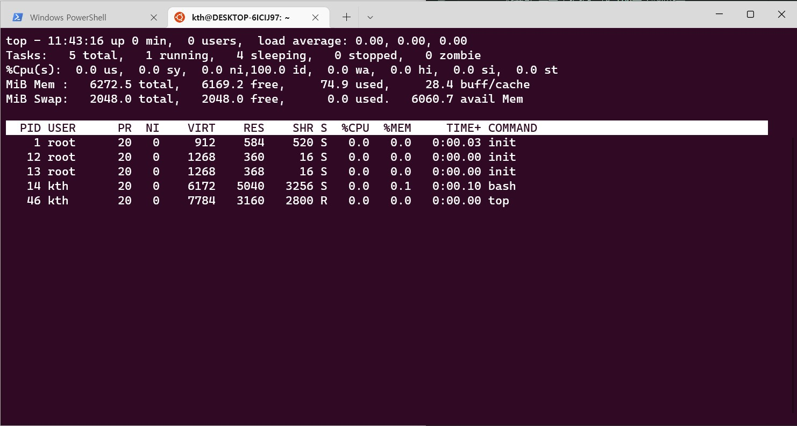
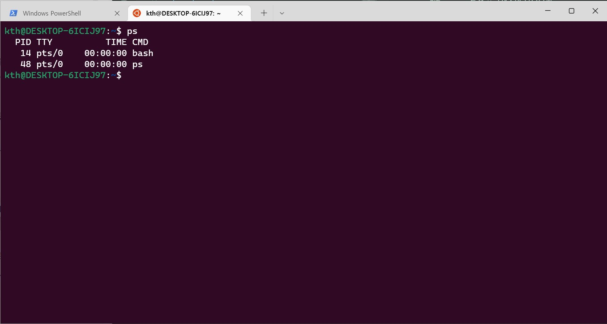
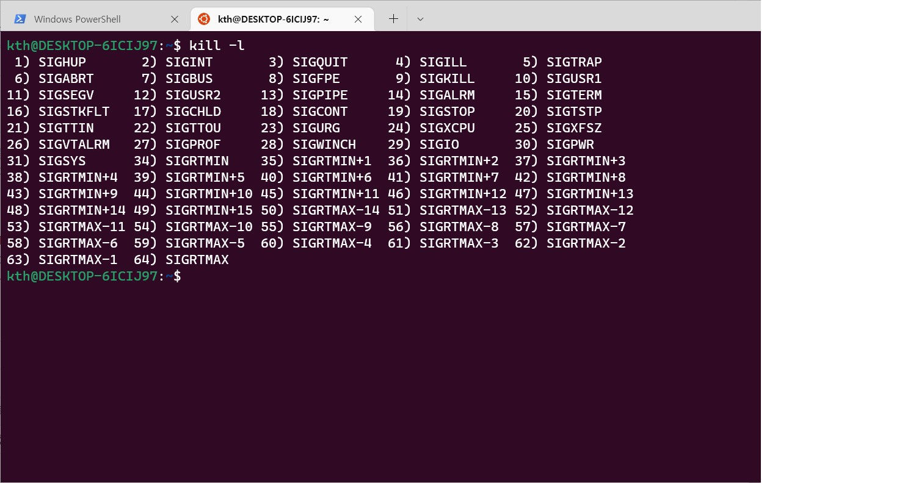

# 20194500_kimtaehyeon_openSW
오픈소스 SW README.md 작성과제를 위한 레포지토리입니다.

# :sparkles: top
> top 명령어는 현재 OS의 상태를 나타내주는 CLI 어플리케이션이다. 메모리 사용량, CPU 사용량 등을 나타내주며 top을 실행하는 동안에는 주기적인 업데이트로 시리간에 근접한 내용을 보여준다.

### 주요 기능
+ 실시간 시스템 상태 모니터링: CPU, 메모리 사용량, 프로세스 상태 등
+ 프로세스 정렬 및 필터링: CPU 사용량, 메모리 사용량 등으로 정렬
+ 프로세스 제어: 프로세스를 종료하거나 우선순위를 변경 가능

### 주요 옵션

|옵션|설명|
|----|----|
|-d seconds| 화면 갱신 주기 설정 (기본 값 3초)
|-p PID|특정 프로세스만 모니터링
|-n iterations|지정한 횟수만큼 갱신 후 종료|

# :sparkles: ps
> ps 명령어는 현재 시스템에서 실행 중인 목록을 출력한다. 스냅샷 형식으로 출력되며 다양한 옵션을 통해 상세한 정보를 확인할 수 있다.

### 주요 기능
+ 프로세스 목록 출력: 실행 중인 모든 프로세스 또는 특정 조건에 맞는 프로세스
+ 프로세스 정보 제공: PID, 사용자, CPU 사용량, 메모리 사용량, 실행 시간 등

### 주요 옵션

|옵션|설명|
|----|----|
|-e | 시스템의 모든 프로세스 출력
|-f|풀 포맷으로 출력(UID, PID, PPID, C, STIME, TTY, TIME, CMD 포함)
|-u user|특정 사용자의 프로세스 출력|
|-p PID|특정 PID의 프로세스 출력

# :sparkles: jobs
> jobs 명령어는 현재 쉘 세션에서 백그라운드로 실행 중인 작업 목록을 출력한다.
> 
### 주요 기능
+ 백그라운드 작업 관리: 작업 ID, 상태, 명령어 표시
+ 작업 상태 확인: 실행 중, 중지됨, 백그라운드 실행 등

### 주요 옵션

|옵션|설명|
|----|----|
|-l|각 작업의 프로세스 ID와 함께 출력
|-n|상태가 변경된 작업만 출력
|-p|각 작업의 프로세스 ID만 출력

# :sparkles: kill
> kill 명령어는 특정 프로세스에 시그널을 보내 종료하거나 제어할 수 있습니다. 주로 프로세스를 종료할 때 사용되며, 다양한 시그널을 통해 프로세스에 다양한 명령을 보낼 수 있다.

### 주요 기능
+ 프로세스 종료: 기본적으로 SIGTERM 시그널을 보내 프로세스 종료
+ 강제 종료: SIGKILL 시그널을 사용하여 강제 종료
+ 다양한 시그널 지원: SIGHUP, SIGINT, SIGSTOP, SIGCONT 등

### 주요 옵션

|옵션|설명|
|----|----|
|-s signal|보낼 시그널을 지정
|-l|사용할 수 있는 시그널 목록 출력
|-PID|종료할 프로세스의 PID 지정
